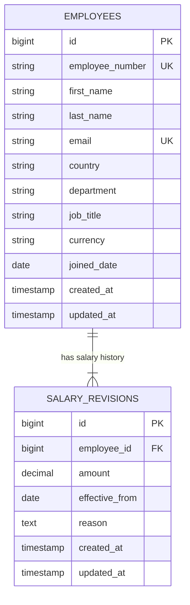

# Data Model — ACME Salary Management System

**MVP schema · Draft for review**

## Overview

The system has two entities: **Employee** and **SalaryRevision**. An employee holds identity and employment information; salary revisions preserve the employee’s compensation history. Current salary is derived from effective dates rather than stored separately.

This design follows the [requirements](requirements.md) and [design decisions](decisions.md). Employee profiles and currencies are fixed in the MVP, while salary changes append new records. Authentication and employee lifecycle management are outside scope.

## Entity relationship diagram

Each employee must have at least one salary revision. Each revision belongs to exactly one employee. Creating an employee and its initial salary is one atomic operation; a foreign key alone cannot enforce the minimum-one-revision rule.

## Entities

### Employee

Stores the employee’s identity, organizational placement, and compensation currency.

| Column | Data type | Constraints | Purpose |
| --- | --- | --- | --- |
| `id` | BIGINT | Primary key, generated | Internal employee identifier. |
| `employee_number` | VARCHAR(20) | Unique, required | Human-readable identifier, such as `EMP-00001`. |
| `first_name` | VARCHAR(100) | Required, nonblank | Employee’s first name. |
| `last_name` | VARCHAR(100) | Required, nonblank | Employee’s last name. |
| `email` | VARCHAR(255) | Required, case-insensitively unique | Work email, trimmed and stored in lowercase. |
| `country` | VARCHAR(2) | Required, supported value | Country code, such as `IN` or `US`. |
| `department` | VARCHAR(100) | Required, controlled value | Department used for filtering and reporting. |
| `job_title` | VARCHAR(100) | Required, controlled value | Employee’s job title. |
| `currency` | VARCHAR(3) | Required, supported value | Fixed compensation currency: `INR`, `USD`, `EUR`, or `GBP`. |
| `joined_date` | DATE | Required | Employment start date; not in the future for seeded active employees. |
| `created_at` | TIMESTAMP | Required, server-managed | Record creation time in UTC. |
| `updated_at` | TIMESTAMP | Required, server-managed | Record update time in UTC. |

### SalaryRevision

Stores an initial salary or a subsequent change. Records are appended and retained; existing revisions are not edited or deleted through the application.

| Column | Data type | Constraints | Purpose |
| --- | --- | --- | --- |
| `id` | BIGINT | Primary key, generated | Revision identifier; resolves same-effective-date ties. |
| `employee_id` | BIGINT | Required foreign key | Employee whose salary this revision describes. |
| `amount` | NUMERIC(15,2) | Required, greater than zero | Gross annual base salary in the employee’s currency. |
| `effective_from` | DATE | Required | Date the salary applies, from employment start through today. |
| `reason` | TEXT | Required, nonblank | Explanation for the change or initial salary entry. |
| `created_at` | TIMESTAMP | Required, server-managed | When the revision was recorded, in UTC. |
| `updated_at` | TIMESTAMP | Required, server-managed | Standard record timestamp; remains equal to creation time for append-only records. |

Salary excludes bonuses, benefits, taxes, and deductions. Amounts accept at most two decimal places and cannot exceed `9,999,999,999,999.99`. Reject excess fractional precision before storage instead of silently rounding it.

## Salary selection and change logic

### Current salary

Select the employee’s revision with the latest effective date on or before the UTC business date. If multiple revisions share that date, the highest revision ID wins. Future-dated entries are rejected; backdating is allowed on or after employment starts.

| Effective date | Revision ID | Amount | Result |
| --- | --- | --- | --- |
| 2026-01-01 | 101 | 100,000.00 | Initial salary. |
| 2026-07-01 | 102 | 120,000.00 | Becomes current on July 1. |
| 2026-04-01 | 103 | 110,000.00 | Backdated entry; July salary remains current. |
| 2026-07-01 | 104 | 125,000.00 | Same-date correction; replaces revision 102 as current, preserving both records. |

History is displayed by effective date descending, then revision ID descending. An amount equal to the current salary may still be meaningful at a different effective date.

### Latest recorded revision

The highest revision ID identifies the latest recorded change for an employee. It can differ from the current salary’s ID: after revision 103 above, the latest recorded ID is 103 but the current salary is still revision 102.

### Safe salary changes

1. Load the displayed salary and latest revision ID from one consistent database snapshot.
2. When saving, begin a transaction and acquire a row lock on the employee.
3. Read the employee’s latest revision ID again and compare it with the submitted ID.
4. If they differ, reject the stale submission with HTTP 409. Otherwise, validate and append the revision.
5. Commit the change and release the lock. Any failure rolls back the operation.

A missing or malformed token receives HTTP 422. Keep transactions short and require every salary-insertion path to lock the employee before generating the revision ID. This serializes entries for the same employee, making their IDs suitable for tie-breaking; IDs do not represent global commit order across employees.

The lock prevents overlapping writes, while the ID comparison detects outdated forms. Row locking alone does not detect stale browser data. A repeated request with an old token cannot create another revision; after an uncertain response, reload history before intentionally resubmitting. No employee update or separate version counter is needed.

## Indexes

| Table | Index | Type | Purpose |
| --- | --- | --- | --- |
| `employees` | `employee_number` | Unique B-tree | Identifier lookup and uniqueness. |
| `employees` | Lowercase email expression | Unique B-tree | Case-insensitive email uniqueness. |
| `salary_revisions` | `(employee_id, effective_from DESC, id DESC)` | Composite B-tree | Current-salary selection and ordered history. |
| `salary_revisions` | `(employee_id, id DESC)` | Composite B-tree | Latest-recorded revision lookup for stale-edit detection. |

Primary keys are indexed automatically. The two salary indexes serve different orderings and also support employee-based lookups. Do not make employee/effective-date pairs unique: same-date corrections must remain possible. Add country, department, or search indexes only after inspecting actual query plans; ordinary name indexes do not generally accelerate leading-wildcard substring search.

## Design rationale

### Separate salary history from employee details

Employee identity and compensation changes have different lifecycles. A separate revision table preserves changes without repeatedly copying the employee profile. Corrections are new entries, keeping prior values and explanations available.

### Derive current salary from history

A separate current-salary amount would duplicate financial state and require synchronization with history. Deriving it keeps one source of truth and handles backdated entries consistently. The trade-off is a more involved read query, supported by the effective-date index and verified through performance measurements.

### Use exact decimal amounts

Floating-point representation is unsuitable for exact salary values. NUMERIC(15,2) provides 13 integral digits and two fractional digits. APIs should transmit amounts as decimal strings, preserving precision through the browser boundary.

### Store currency once on Employee

The MVP fixes each employee’s currency, so duplicating it on every revision would add a consistency obligation without supporting an in-scope workflow. A future currency-change feature must add historical currency representation before employee currency can be changed.

### Avoid separate version columns

Every revision already has a unique ID. Combining that existing ID with an employee row lock supports same-date precedence and stale-edit detection without maintaining another counter. This relies on append-only history and a shared locking protocol for every insertion path.

### Keep organizational attributes as controlled strings

Country, department, and job title have no management workflows in the MVP. Controlled values keep filtering consistent with a small schema. Lookup tables become appropriate if organizational renaming, administration, or stronger referential integrity is required.

### Preserve history when employees are referenced

Restrict deletion of employees with salary revisions rather than cascading history deletion. Employee deletion is outside scope. Append-only is an application guarantee, not protection against privileged database edits.

## Domain invariants and enforcement

| Rule | Enforcement |
| --- | --- |
| Employee number and normalized email are unique. | Database unique indexes, supported by application validation. |
| Every revision references an existing employee; referenced employees cannot be deleted. | Foreign key with restricted deletion. |
| Required values are present and text fields are nonblank. | Non-null constraints, text checks, and application validation. |
| Salary is positive and uses a supported employee currency. | Database checks and application validation; raw input precision checked before conversion. |
| Effective date is between employment start and the UTC business date. | Application validation; this cross-record, time-dependent rule is not a simple static row constraint. |
| Every employee starts with at least one revision. | Atomic seed creation and verification; not guaranteed by the foreign key alone. |
| Accepted revisions remain unchanged, and stale submissions do not append records. | Shared transactional write operation and concurrency tests. |
