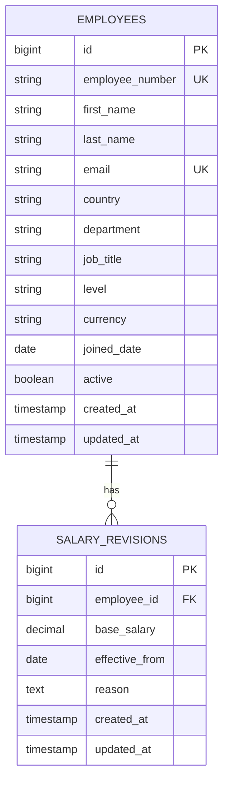

# Data Model — ACME Salary Management System

## Overview

The implemented schema has two entities. Employee stores identity and organizational data. SalaryRevision stores annual base-salary history. Current salary is derived from history and is not duplicated on Employee.

An employee may temporarily have no salary revisions, although the seed task creates one initial revision for each seeded employee.

## Employees

| Column | Database type | Implemented constraint or behavior |
| --- | --- | --- |
| `id` | BIGINT | Primary key |
| `employee_number` | VARCHAR(20) | Required, unique index |
| `first_name` | VARCHAR(100) | Required at database level |
| `last_name` | VARCHAR(100) | Required at database level |
| `email` | VARCHAR(255) | Required, unique index |
| `country` | VARCHAR(2) | Required |
| `department` | VARCHAR(100) | Required |
| `job_title` | VARCHAR(100) | Required |
| `level` | VARCHAR(50) | Required; model allowlist |
| `currency` | VARCHAR(3) | Required; INR, USD, EUR, or GBP model allowlist |
| `joined_date` | DATE | Required |
| `active` | BOOLEAN | Required, defaults to true |
| `created_at` | TIMESTAMP | Rails-managed, required |
| `updated_at` | TIMESTAMP | Rails-managed, required |

The API exposes seeded employee profiles as read-only. `Employee.active` supplies the directory and summary population.

## Salary revisions

| Column | Database type | Implemented constraint or behavior |
| --- | --- | --- |
| `id` | BIGINT | Primary key and same-date tie-breaker |
| `employee_id` | BIGINT | Required foreign key to employees; indexed |
| `base_salary` | NUMERIC(15,2) | Required; model requires a value greater than zero |
| `effective_from` | DATE | Required in database and model |
| `reason` | TEXT | Required in database and model |
| `created_at` | TIMESTAMP | Rails-managed, required |
| `updated_at` | TIMESTAMP | Rails-managed, required |

The public API supports creation only. This gives the application append-only behavior, although privileged database access could still alter records.

## Current salary and history

For an employee:

1. Ignore revisions with `effective_from` after today.
2. Order remaining revisions by effective date descending.
3. For the same effective date, order by ID descending.
4. Use the first revision as current salary.

The employee detail response uses the same order for visible history. Analytics perform equivalent current-revision selection in PostgreSQL before summing annual salaries and dividing by 12.

## Salary creation

The salary endpoint:

1. Finds the employee.
2. Acquires a row lock with `employee.with_lock`.
3. Validates and inserts the revision inside the transaction.
4. Returns HTTP 201 on success or field errors on validation failure.

The lock serializes writes for the same employee. The implementation does not compare a revision token and therefore does not detect a stale browser view after waiting.

## Indexes

| Table | Index | Purpose |
| --- | --- | --- |
| `employees` | Unique `employee_number` | Identifier uniqueness and lookup |
| `employees` | Unique `email` | Email uniqueness and lookup |
| `salary_revisions` | `employee_id` | Association lookup and foreign-key access |

Primary keys are indexed automatically. A composite `(employee_id, effective_from DESC, id DESC)` index is a measured-performance candidate, not an implemented index.

## Design rationale

### Separate employee and salary history

Identity and compensation have different lifecycles. A separate table preserves each accepted revision without copying the employee profile.

### Derive current salary

Keeping salary history as the source of truth avoids synchronizing a separate current-salary column. The trade-off is ordering work during detail and analytics reads.

### Store currency on Employee

Currency is fixed for the assessment, so storing it once avoids duplicating it on every salary revision. Historical currency changes would require a different model.

### Keep organizational values as strings

There are no country, department, title, or level administration workflows. Strings keep the schema small; lookup tables would be appropriate if those entities became editable.

## Known limitations

- Database constraints enforce non-null fields and referential integrity, while several text fields rely on controlled seed data rather than full model validation.
- The email unique index is case-sensitive; the seed normalizes generated emails to lowercase.
- `NUMERIC(15,2)` provides exact stored values, but the model does not explicitly reject input with more than two fractional digits before PostgreSQL conversion.
- Effective dates are required but are not restricted to the employee’s join date or today.
- Salary history is not separately paginated.
